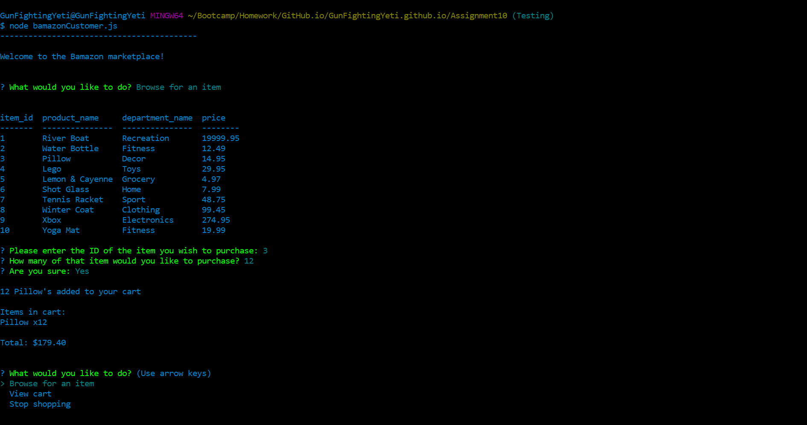

# Bamazon.js

Image

## Here's how the program works
### If the name wasn't a give away, this program is based off of Amazon.  It is an interactive marketplace.  With a MySQL database keeping track of all inventory on the backend and NodeJS running the front.  

### Once the program is running you will be given several options.

#### What would you like to do - This is the "main menu" of the app, it lets you choose to...
 * Browse for an item
 * View your cart
 * Stop shopping

Video Link

#### Browse for an item - This will prompt you to answer three questions
 1. Enter the ID of the item you would like to purchase
 2. Enter the quantity of the item(s) you would like to purchase
 3. Are you sure? - This let's you back out of the purchase
###### Once you confirm a purchase and add it to your cart the product is taken out of inventory.  This keeps a customer from over-purchasing an item bacause the database is behind.

Video Link

#### View your cart
 * If you have not added any items yet, this will show nothing
 * If there are items in your cart this will show the items and the total cost to purchase your cart
 * You will then be asked to choose from several questions
    1. Purchase all items
    2. Empty your cart
    3. Browse for an item
    4. Stop shopping
###### When you empty the cart or stop shopping, whatever items are in your cart are added back into the database.  The only option that permenantly takes items out of the database is to purchase.

Video Link

## Getting Started: 
### To start the app, open a command line or terminal window and type, "node bamazonCustomer.js"  This will start the app and begin the prompts.  No other commands are needed.

## Prerequisites: 
### NodeJS
#### You will need to have node installed on your local machine.

### MySQL
#### Make sure that MySQL is installed on your local machine.  Run the .sql file to create the MySQL database that bamazon queries. 

### Node packages (These are noted in the package.json)
### Console.Table
#### You will need the npm package console.table in order to display the database information nicely.

### Inquirer
#### You will also need the npm package inquierer to handle the question prompts.

## Built With: 
* VS Code
* NodeJS
* MySQL
* Console.Table
* Inquirer

## Authors: 
Tim Lewis

## License
ISC

## Acknowledgments
DU's coding botcamp for teaching me almost everything that I know 
The Best Friends Gang for helping me when I got stuck
