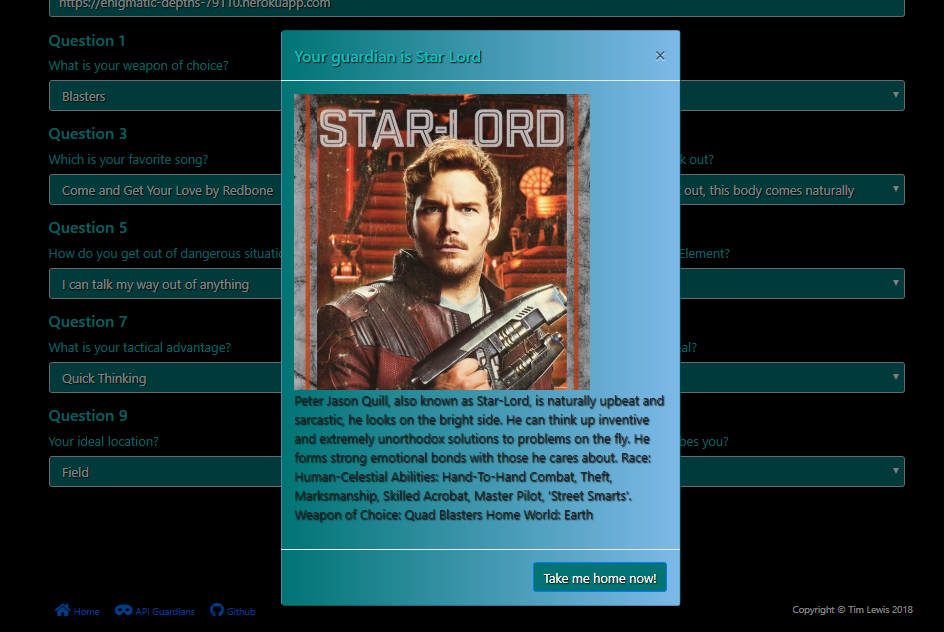

# Guardians of the Galaxy Quiz (Friend Finder)

Image

## Here's how the program works

### Press a button!
#### If you have always wondered what Guardian of the Galaxy you are most like then you have come to the right place.  This quiz will ask you ten questions, compare your answers to the actual answers of the guardians and find out which Guardian you are most like.   

#### After landing on the home page you need to be decisive and click the "Take the Quiz" button.  Otherwise, you're not cut out to be a Guardian.  They need to be able to press button when the time comes.

#### If you've summoned up the courage to join the Guardians and pressed a single button then you've passed!  You're well on your way to being compare to someone else.  You'll be directed to page two, where the magic really happens.

### Enter two things!

Image

#### Here you will be asked to enter your name, to be used only for future hero purposes.  As well as a heroic image of yourself.  Please keep it clean as this image will be used for your trading cards should you be chosen.

### Answer some questions!

Image

#### Now, the part for which you've been waiting. Choose answers to these ten questions and you will be compared, scrutinized and judged as a person to find out which Guardian you are most like. (You're information will also be saved to be used for future hero needs)

### Receive the knowledge!

Image

#### Bask in the similarities between you and another person!

Video Link

## Getting Started: 
### To start the app, you will need to

## Prerequisites: 
### NodeJS
#### You will need to have node installed on your local machine.

### Node packages (These are noted in the package.json)
### Console.Table
#### You will need the npm package console.table in order to display the database information nicely.

## Built With: 
* VS Code
* NodeJS

## Authors: 
Tim Lewis

## License
ISC

## Acknowledgments
DU's coding botcamp for teaching me almost everything that I know 
The Best Friends Gang for helping me when I got stuck
