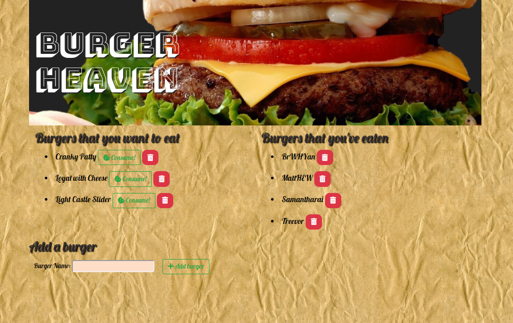
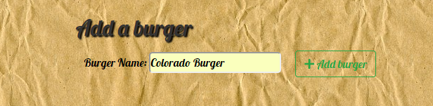

# Burger Heaven

Image

## Here's how the program works

### Add to your list any burger that you would like to eat
#### Simply type the name of the burger into the text box below.  Once you have entered your desired name, click the "+ Add burger" button.  

Image

### Check off the burger that you have eaten
#### After successfully adding your burger to the list (As well as the MySQL database keeping track of your list) then you can "Consume!" your burger.  Showing that you have checked it off of your burger-to-eat list.

#### At any time you can also delete a burger.  Should you add a burger to your list by accident or lose interest in trying a burger all that need be done is to click the trash can icon.  The red trash can will send your burger hurtling into the abyss of internety nothingness. 

## Getting Started: 
### To start the app, you will need to clone the repo to your local machine and install the below programs and dependencies.
#### Once those are installed and running open a terminal window and run the command "node server.js".  "App listening on PORT 8080" should display in the window.  Once that message appears, open up your web browser and go to "localhost:8080".  That's it, you're ready to enjoy burger tracking to your hearts content.

## Prerequisites: 
* NodeJS
* Browser of choice (Chrome is prefered)

### Node packages (These are noted in the package.json)
#### Just run the command "npm i" from a terminal window while inside the same directory as server.js to install all dependant packages
* Express
* Express-Handlebars
* MySQL

## Built With: 
* VS Code
* NodeJS
* Express
* Express Handlebars
* MySQL
* HTML5
* CSS3
* Javascript
* Jquery

## Authors: 
Tim Lewis

## License
ISC

## Acknowledgments
DU's coding bootcamp for teaching me almost everything that I know 
The Best Friends Gang for helping me when I got stuck
