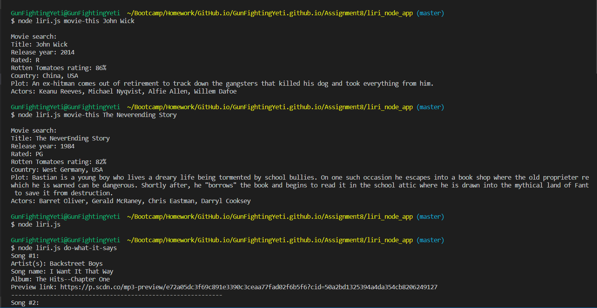
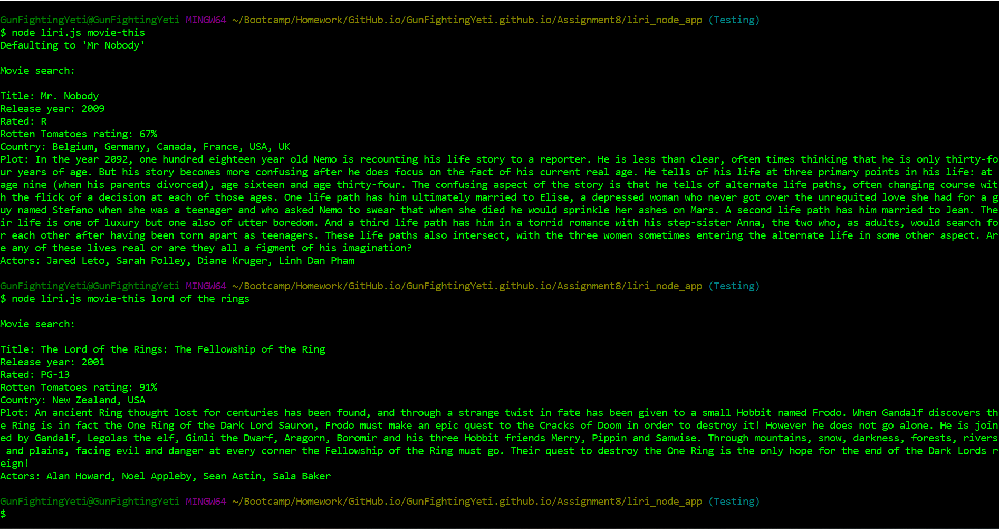
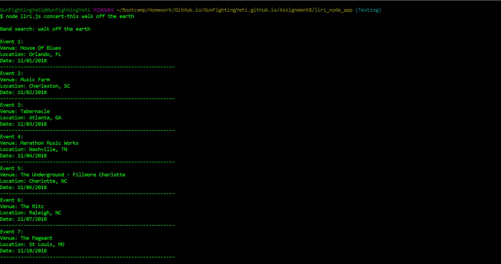
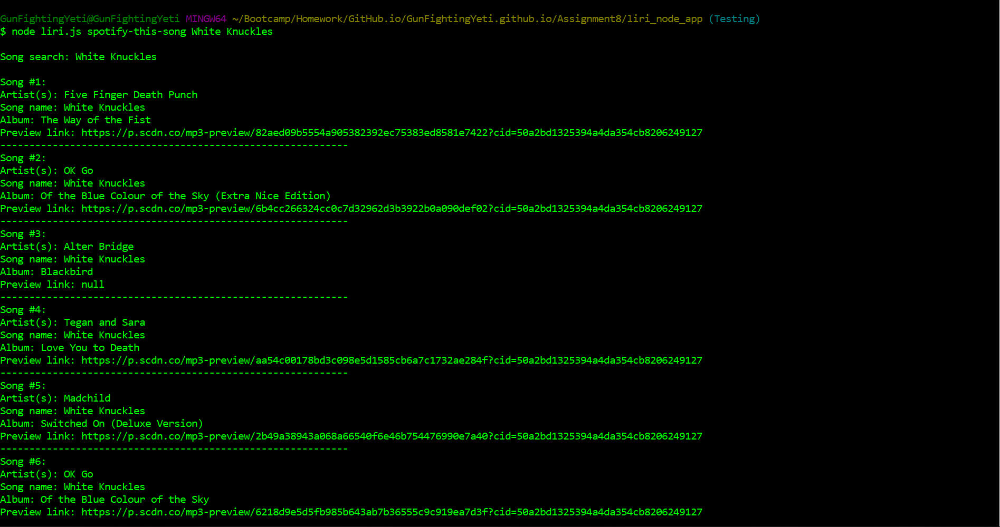
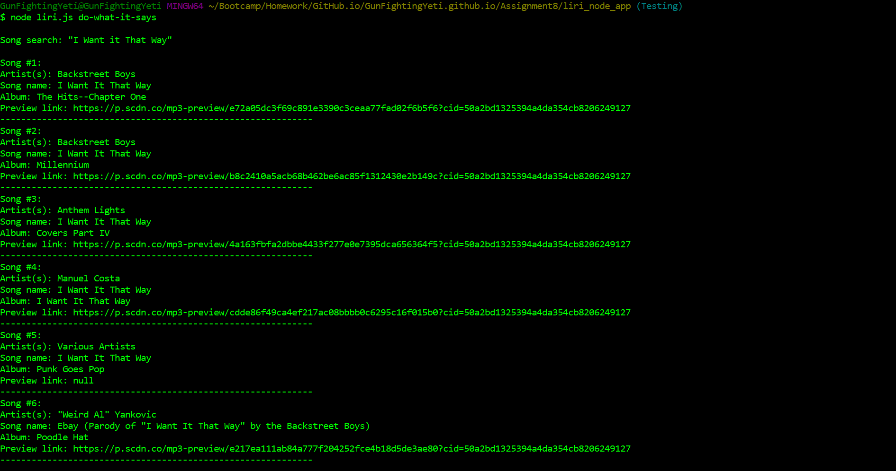

# Liri.js

## Here's how the program works
### This program takes inspiration from Apple's Siri but is limited to command line searches for Songs, Movies and Concerts.

Image


### There are multiple commands that Liri accepts.  If you don't know those commands yet, then you can run the file and it will prompt you with acceptable commands.


### Movie-this command
##### Typing the command "movie-this" followed by the name of any movie will search the OMDB database and bring back the Title, Release year, Rating, Rotten Tomatoes rating, Country, Plot and Actors.
Video Link

<a href="http://www.youtube.com/watch?feature=player_embedded&v=uyjJM3oopYU" target="_blank"></a>


### Concert-this command
##### Typing the command "concert-this" followed by the name of any active band will search the Bands in Town database and bring back the Event number, Venue, Location and Date.
Video Link

<a href="http://www.youtube.com/watch?feature=player_embedded&v=xiluqCBvQ28" target="_blank"></a>


### Spotify-this-song command
##### Typing the command "spotify-this-song" followed by the name of any song will search the Spotify database and bring back the Song Number, Artist(s), Song Name, Album and a Preview Link.
Video Link

<a href="http://www.youtube.com/watch?feature=player_embedded&v=h5cH6NjVsVQ" target="_blank"></a>


### Do-What-It-Says command
##### Typing the command "do-what-it-says" will start a search from the local file random.txt.  This will kick off whatever command and search type is in the file.
Image



### Log function
##### Every search that is entered will also push the output to a log file. This allows you to go back and check and search results even after the command line has been exited.
Image


## Getting Started
Copy the files in the "liri_node_app" folder to your machine.

## Prerequisites
For this program to work you will need to create the files that are in the .gitignore file.
* node_modules
* DS_Store
* .env
* keys.js


The Node modules are located in the package.json file.


The keys.js file holds the spotify key.  It should look like this...

``` javascript
exports.spotify = {
  id: "YOUR-ID-HERE",
  secret: process.env.SPOTIFY_SECRET
};
```


The .env file holds the secret spotify key.
``` javascript
SPOTIFY_ID=YOUR-ID-HERE
SPOTIFY_SECRET=YOUR-ID-HERE
```


With all those files and the cloned repository, endless searching can be yours! 


## Built With
* Visual Studio Code
* Node.js
* Bandsintown API
* Spotify API
* OMDB API
* Request
* dotenv

## Authors
Tim Lewis

## License
ISC

## Acknowledgments
DU's coding botcamp for teaching me almost everything that I know<br>
The Best Friends Gang for helping me when I got stuck
